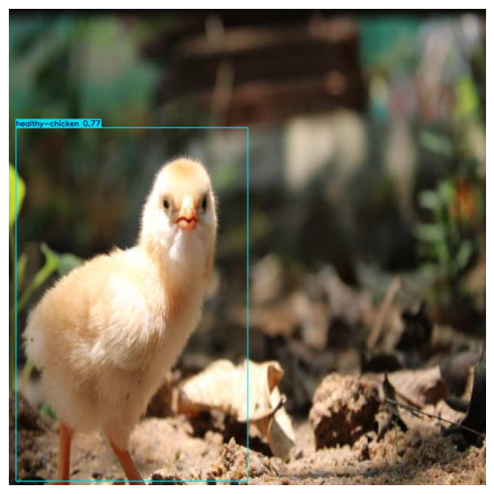
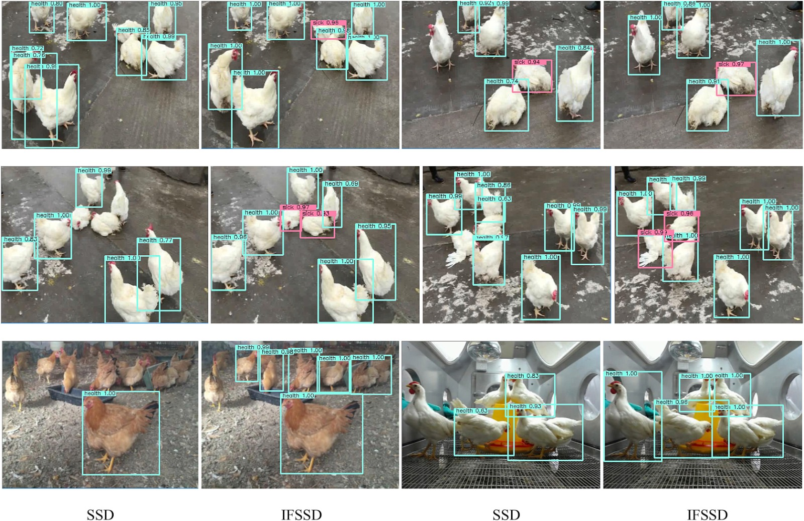

# 🐔 Poultry Watch — Early Disease Detection for Broiler Chickens

Poultry Watch is a computer-vision system that watches a poultry farm (live
camera, CCTV footage, or photos) and flags chickens that look **sick**
before visible symptoms lead to loss — giving farmers a chance to isolate
and treat birds early instead of discovering disease after it has spread.

Built around a fine-tuned **YOLOv8** object detector and deployed as a full
**Django** web application with three detection modes: live camera/CCTV
streaming, recorded video upload, and single-image upload.

---
🖥️ Application Preview

<table> <tr> <td align="center">  </td> <td align="center">  </td> </tr> <tr> <td align="center">  </td> <td align="center">  </td> </tr> </table>
-------
## ✨ Features

- **Binary health classification** — detects each chicken in frame and
  labels it `Healthy` or `Sick`.The goal is early flagging for human review.
- **Three ways to detect:**
  - 📷 **Image upload** — drop in a photo, get an annotated result instantly.
  - 🎥 **Video upload** — process a recorded CCTV clip, with per-bird object
    tracking (ByteTrack) and a sustained-detection window so a bird is only
    flagged sick after staying classified Sick over time — not from a single
    flickering frame (avoids false alarms from a resting/sleeping bird).
  - 📡 **Live camera / CCTV (RTSP)** — real-time detection streamed straight
    into the browser.
- **Per-class confidence thresholds** — tunable independently for `Healthy`
  and `Sick`, so the system's sensitivity to each class can be adjusted
  without retraining.
- **Fine-tuning pipeline** — continues training from a previous checkpoint
  on new data (e.g. real farm footage) with an automatic catastrophic-
  forgetting check against the original dataset.

---
# 🎯 Problem Statement

Disease detection in poultry farms often depends on manually observing chickens after visible symptoms become noticeable.

This can lead to:

- delayed disease detection
- increased disease transmission
- higher mortality
- increased treatment costs
- difficulty monitoring large numbers of birds continuously

Poultry Watch aims to provide an automated **early-warning layer** by continuously analyzing visual footage and flagging chickens that are classified as potentially sick.

---

## 🧠 How It Works

```
Camera / Video / Image
        │
        ▼
  YOLOv8 object detector  ──►  per-chicken bounding box + Healthy/Sick label
        │
        ▼
  ByteTrack (video/live)  ──►  persistent ID per bird across frames
        │
        ▼
  Sustained-detection check ──► reduces false positives (e.g. a resting bird)
        │
        ▼
     Django web UI  ──►  annotated output + health summary
```

---

## 🛠️ Tech Stack

| Layer | Tools |
|---|---|
| Detection model | YOLOv8 (Ultralytics), fine-tuned on a Healthy/Sick broiler chicken dataset |
| Tracking | ByteTrack (multi-object tracking for video/live streams) |
| Backend / Web app | Django, OpenCV |
| Dataset tooling | Python, PyYAML, OpenCV |

---

## 📂 Project Structure

```
├── poultry_django_app/        # Django web application
│   ├── detector/               # App: views, model loading, templates
│   │   ├── model_loader.py      # YOLO inference (image/video/live)
│   │   ├── views.py
│   │   └── templates/
│   └── poultry_web/            # Django project settings
│
└── poultry_disease_detection/  # Training & dataset pipeline (scripts)
    ├── train.py                 # Initial training
    ├── fine_tune_on_new_data.py # Continued training + forgetting check
    ├── test_dataset_eval.py     # Evaluation on held-out test set
    ├── process_cctv_footage.py  # Batch processing of recorded footage
    ├── check_dataset_classes.py # Class balance / label inspection
    ├── balance_dataset.py       # Minority-class oversampling / undersampling
    ├── verify_and_clean_dataset.py        # Label validation & cleanup
    └── convert_segmentation_to_detection.py
```

---

## 🚀 Getting Started

```bash
git clone https://github.com/AqibMehmoodMalik/poultry-watch.git
cd poultry-watch/poultry_django_app

python -m venv venv
source venv/bin/activate        # Windows: venv\Scripts\activate
pip install -r requirements.txt


mujhy apna github ki readme main khuch images b add karni hy for as a refrence iss k liye mujhy readme file ko updat kar duu takye main uss main links /urls upload kar sako ...
or agar readme file k andar k content ka best version b  dyy saktye huu tuu woo b bestest  duu... or improve kar duu
